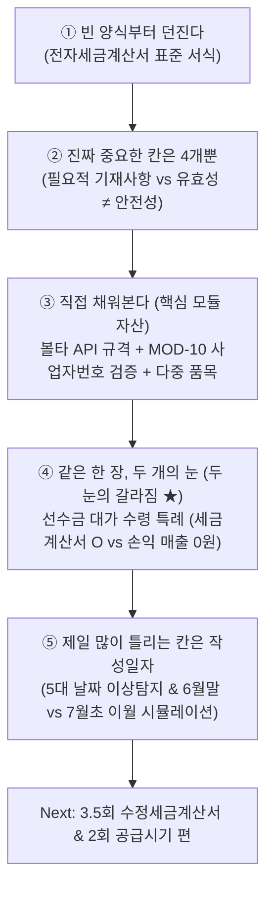

# 회무사(회계사 x 세무사) 1회 기획안 & 장부로/볼타(Bolta) API 세무 모듈 구현 보고서

> **"발행이 아니라 작성. 지식 전달이 아니라 겁 빼기."**  
> 회계사와 세무사의 시선이 한 종이 위에서 만나는 시그니처 콘텐츠 파이프라인 & 중소기업 ERP 세무 엔진 스키마.

---

## 1. 회무사 1회 기획 컨셉 & 2026 세법 실무 사실관계 보완

### 1-1. 핵심 전환 (Core Thesis)
- **핵심 전환**: "발행(홈택스·팝빌·볼타 버튼 누르기)"은 실수하면 가산세가 부과되는 겁나는 일이지만, **"작성"은 단순한 종이 칸 채우기**입니다.
- **감정적 클라이맥스**: 필요적 기재사항(4가지)을 채우면 초록불 4개가 켜지고, **"법적으로 유효합니다"**가 표시됩니다.

### 1-2. 세법 실무 3대 필수 표기사항 (오답 유발 방지 각주)
1. **면세 공급가액 포함 산정**: 개인사업자 직전 연도 8천만원 이상 의무발급 판정 시 **면세 매출액을 합산**하여 산정합니다.
2. **적용 시점 (7월 1일)**: 기준 충족 시 1월 1일이 아닌 **다음 해 7월 1일부터 적용**됩니다.
3. **영구 계속 적용**: 한 번 의무발급 대상이 되면 이후 매출이 8천만원 미만으로 줄어들더라도 **계속 전자세금계산서 발급 대상**입니다.

### 1-3. "유효성 ≠ 안전성 (Valid ≠ Safe)" 실무 리스크 경고
- 필요적 기재사항이 **적히지 않은 경우**뿐만 아니라 **사실과 다르게 적힌 경우** 모두 매입세액 불공제 사유입니다 (부가가치세법 §39①2).
- 초록불 4개가 켜진 후 **"유효합니다. 단, 유효 ≠ 무사고"** 경고 문구를 제시하여:
  - ① 품목란 공란 시 세무조사에서 거래 실질 입증 부담이 공급자에게 발생하는 점,
  - ② 접대비/차량유지비 등 불공제 항목 판정 불가 리스크가 공급받는자에게 넘어가는 점을 명시합니다.

---

## 2. 콘텐츠 5블록 구조 & 시그니처 프레임 개선 (선수금 두 눈 불일치)



### 블록 ④ 회무사 시그니처 프레임: 선수금(Advance Payment) 두 눈 불일치 케이스
- **거래 상황**: 7월 15일 계약금 1,100만원 수령 후 세금계산서 발행 (용역 완수일은 8월 말).
- **🔵 회계사의 눈 (발생주의)**:  
  ` (차) 보통예금 1,100만원 / (대) 선수금 1,000만원, 부가가치세예수금 100만원 `  
  ➔ **7월 손익계산서 매출 = 0원!** (용역미완성으로 수익 인식 불가)
- **🔴 세무사의 눈 (부세법 §17 대가 수령 특례)**:  
  ➔ **7월 부가세 신고서 과세표준 = 1,000만원 적법 반영!**  
- **"세금계산서는 발행되었는데 매출은 0원이다!"** ➔ 이 한 컷이 회무사 프레임을 정당화하며 중소기업 ERP 엔진이 자동화해야 하는 핵심 지점입니다.

---

## 3. 장부로/ERP 세무 엔진 공통지식 스키마 (5대 날짜 & 3층 지식)

### 3-1. 5대 날짜 스키마 (5-Date Schema)
| 날짜 필드 | 설명 | 세무 / 회계 역할 | 이상탐지 룰 (Delta) |
| :--- | :--- | :--- | :--- |
| **`writeDate` (작성연월일)** | 세금계산서 상 작성일자 | 부가세 과세기간 귀속 결정 | `writeDate ≠ statutorySupplyDate` → 과세기간 이월 오류 |
| **`issuedAt` (발급일시)** | 국세청/볼타 시스템 발급 시각 | 지연발급 가산세(1%) 판정 | `issuedAt > 작성일 익월 10일` → 지연발급 가산세 |
| **`transmittedAt` (전송일시)** | 국세청 전송 시각 | 지연전송 가산세(0.3%) 판정 | `transmittedAt > issuedAt + 1일` → 지연전송 가산세 |
| **`statutorySupplyDate` (공급시기)** | 법정 용역완료/재화인도일 | 작성일자 적법성 판정 기준 | 작성일 적법성 검증 기준 |
| **`revenueRecognizedAt` (수익인식일)** | 발생주의 매출 계상일 | 손익계산서 P&L 계상 | `revenueRecognizedAt ≠ writeDate` → 선수금/미수금 계상 |
| **`paymentDate` (결제일)** | 대금 입금/결제 완료일 | 채권 소멸 / 현금흐름 | `paymentDate 없음 + 90일` → 대손 검토 대상 |

### 3-2. 지식의 3층 분리 구조 (Rule - Judgment - Practice)
1. **1층 규칙(Rule)**: 법령 확정 사항 (세율 10%, 필요적 기재사항 4항목, 가산세율) ➔ 하드코딩 / 룰 엔진
2. **2층 판단(Judgment)**: 사실관계 해석 필요 (용역 완료 시점, 거래 분할 여부, 계속적 공급 판단) ➔ LLM + 사례 RAG
3. **3층 관행(Practice)**: 업계 습관 (월말 일괄발행, 품목 뭉갬) ➔ 데이터 축적으로 해결

---

## 4. 볼타(Bolta) API 호환 모듈 코드 구조

```text
src/modules/tax-invoice/
├── types/                 # TaxInvoiceData, 5-Date Schema, AmendmentReasonCode (1~6)
├── utils/                 # MOD-10 검증, 10% VAT 계산, 발급기한 계산, 5-Date 이상탐지
├── hooks/                 # Headless Hook (useTaxInvoiceForm)
├── api/                   # Bolta API 연동 클라이언트 (BoltaTaxInvoiceApiClient)
├── components/            # TaxInvoiceForm (표준 Red 서식), TwoEyesSplitViewer (선수금 시뮬레이터)
└── index.ts               # Barrel Export
```

---

## 5. 시리즈 ↔ ERP 엔진 매핑 & 전체 커리큘럼

- **1회**: 일단 한 장 채워보는 세금계산서 *(완성 - 5대 날짜 & 선수금 두 눈 불일치)*
- **2회**: 공급시기와 과세기간의 미학 *(기간귀속 이상탐지)*
- **3회**: 매입세액 불공제 7가지 잔혹사 *(계정분류 + 세무조정 룰)*
- **3.5회 (신규)**: 수정세금계산서 6가지 사유코드와 소급 작성의 미학 *(볼타 amendment_code)*
- **4회**: 분개 한 줄에서 시작하는 선수금과 미수금 *(발생주의 전환 엔진)*
- **5회**: 부가가치세 신고서 한 장과 마감 분개 *(리포팅 / 마감 자동화)*
